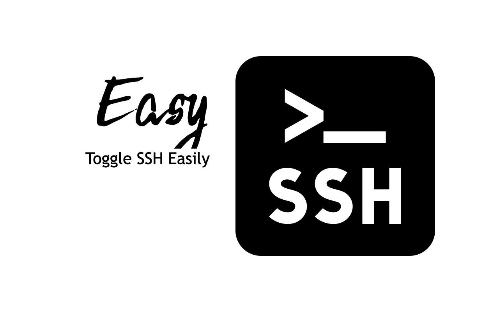

# Easy SSH

Easy SSH is a Decky Loader plugin for the Steam Deck that allows users to quickly toggle the SSH service directly from the Quick Access Menu.

## Requirements

To allow this plugin to function correctly, you must enable Developer Mode on your Steam Deck:
1. Press the Steam button.
2. Navigate to **Settings** -> **System**.
3. Toggle **Enable Developer Mode**.

## Features

* **Toggle SSH:** Instantly start or stop the SSH service without entering Desktop mode.
* **IP Address Display:** View your Steam Deck's current local IP address for quick remote connections.
* **Logs:** Integrated backend logging displayed directly in the UI for easy troubleshooting.

## Installation

### Install via Decky Loader

1. Open **Settings** in Game Mode.
2. Navigate to **Network** -> **Developer Mode**.
3. Look for "Easy SSH" in the list of available plugins and select **Install**.

### Install via Manual Download

1. Download the latest release from the **Releases** tab on GitHub.
2. Extract the contents of the ZIP file.
3. Copy the `Easy SSH` folder to your Steam Deck's plugins directory:
   - `\home\deck\.local\share\decky-loader\plugins\`
4. Restart Decky Loader (Toggle Developer Mode off and on again).

## License

This project is licensed under the MIT License.
